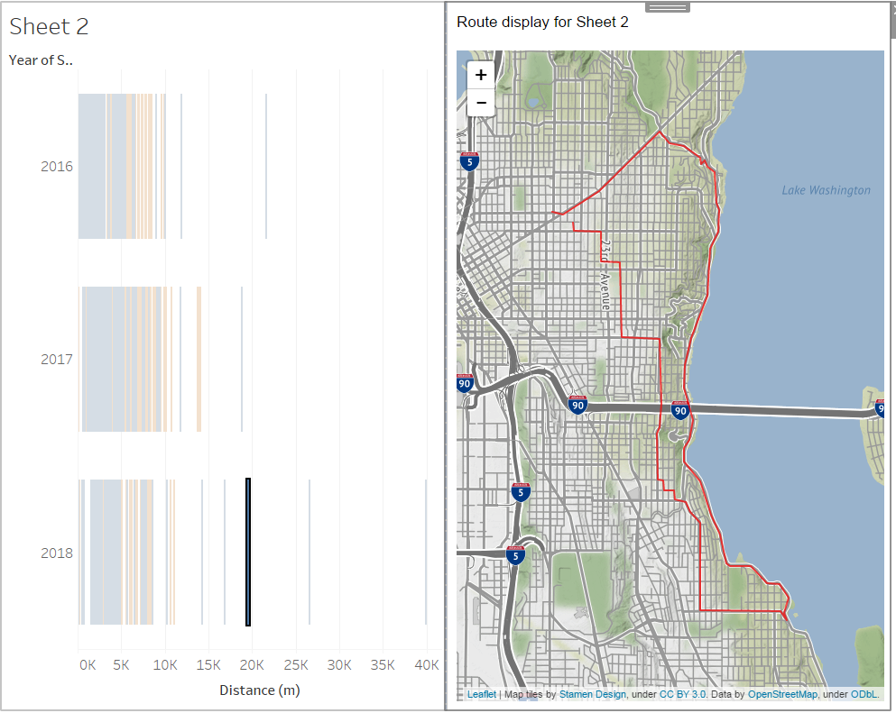

# PolylineViewer

Tableau extensions are web applications that can interact and communicate with Tableau. This application lets you visualize an encoded polyline from your data.

Requirements
- you must have Tableau Desktop 2018.2 to use extensions
- must be online to run this extension

Usage:
- [in progress - need to download the extension and run in dev mode currently]
- open the workbook that contains your data and create a dashboard. Add the sheet you want to select marks from to map.
- From the Objects panel, select 'Extension' to add an extension panel to your dashboard. In the dialog that appears, select 'My Extensions' and browse to the directory where you saved the files earlier. Select PolylineViewer.trex
- Now with the extension available in your dashboard, select items from the sheet and see them mapped out!

Example: 
Using the Strava web data connector, I can pull down only my activity data (no huge GPS download) and still render maps of my rides

